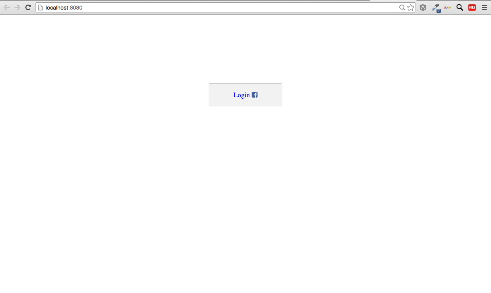

# starterTemplate-Social-Login
a Javascript starter template for logging in users with their social account information using the Stamplay SDK

**CLONING: When cloning this repo, you must initialize your app first to make it work.**

 1) **Initialize the front-end of your app with Stamplay**
 <br>
- Go to your command line and enter **stamplay init**
- When prompted, enter your **appID** & **API Key**

2) **Initialize the SDK library in your app**
<br>
- In your index.html file, enter the SDK cdn script (or install with bower if you prefer)
```
<script src="//drrjhlchpvi7e.cloudfront.net/libs/stamplay-js-sdk/1.3.1/stamplay.min.js"></script>

```
```
$ bower install stamplay-js-sdk
```
- In your Javascript file, enter the initialization script at the top of the file
```
Stamplay.init('yourAppId');
```

3) **Connect to Facebook**
- Go to **https://developers.facebook.com** and login (sign up for an account if you don't have one)
- Select **My apps** and click on **Add a new app**
- Choose **Website**
- Enter an **app name**
- In the url field, enter **https://[yourAppId].stamplayapp.com**
- Select **Skip to developer dashboard**
- In the Facebook developer dashboard, copy the **AppID** and **App Secret**.
- Go to the Stamplay editor and select **Users**, then **authentication**. Choose **Facebook**
- Paste the **AppId** and **App Secret** directly into the connection field. Click Save.

4) **Configure Facebook app**
- In the Facebook developer dashboard, select **Settings**.
- Under Basic, enter a valid **contact email**.
- Under Advanced, scroll down to the **Valid OAuth redirect URIs** section and enter in **https://[yourAppId].stamplayapp.com**
and **https://localhost:8080/**
- Go to **Status & Review** and under Status click the toggle switch to **Yes** next to the prompt "Do you want to make this app and all its live features available to the general public?"

5) **login( )**
- For signing in with a 3rd party service, you do not need to pass in any password/email information, instead you pass in the name of the service provider.. Just connect the login() function
with a click event and it will login users and redirect them for you. 
```
function facebook(){
	var newUser = new Stamplay.User().Model;
	newUser.login('facebook');
}
```


